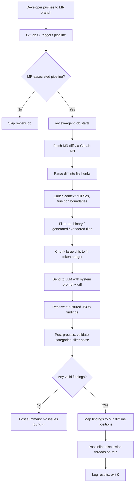

# 🤖 AI Code Review Agent for GitLab CI/CD

An autonomous, pipeline-integrated code review agent that analyzes merge request diffs and posts high-signal review comments — focusing exclusively on logic, correctness, security, and design — while ignoring all stylistic noise.

[](/) [](LICENSE)

---

## Table of Contents

- [1. Project Overview](#1-project-overview)
- [2. High-Level Architecture](#2-high-level-architecture)
- [3. Architecture Diagram](#3-architecture-diagram)
- [4. Implementation Approaches](#4-implementation-approaches)
- [5. Repository & Folder Structure](#5-repository--folder-structure)
- [6. GitLab CI/CD Integration](#6-gitlab-cicd-integration)
- [7. Agent Logic Flow](#7-agent-logic-flow)
- [8. Prompt Engineering Strategy](#8-prompt-engineering-strategy)
- [9. Code Examples](#9-code-examples)
- [10. Edge Case Handling](#10-edge-case-handling)
- [11. Security & Cost Controls](#11-security--cost-controls)
- [12. Extensibility & Future Enhancements](#12-extensibility--future-enhancements)
- [13. Example End-to-End Flow](#13-example-end-to-end-flow)

---

## 1. Project Overview

### What This Agent Does

This project implements a **self-contained Code Review Agent** that:

1. Triggers automatically on every GitLab CI/CD pipeline run associated with a Merge Request.
2. Extracts the diff of changed files via the GitLab API.
3. Sends the diff — enriched with surrounding context — to a configurable LLM (OpenAI, Anthropic, self-hosted, etc.).
4. Parses the LLM's structured response into discrete, actionable review comments.
5. Posts those comments as **inline MR discussion threads** on the exact lines of code they reference.

### Why Traditional Linters Are Insufficient

| Capability | Linters / SAST | AI Code Review Agent |
|---|---|---|
| Formatting / style | ✅ | ❌ Intentionally excluded |
| Known vulnerability patterns | ✅ | ✅ |
| Business logic correctness | ❌ | ✅ |
| Missing edge cases | ❌ | ✅ |
| Cross-function reasoning | ❌ | ✅ |
| Design-level feedback | ❌ | ✅ |
| Positive reinforcement | ❌ | ✅ |

Linters operate on syntax trees and pattern databases. They excel at catching `==` vs `===` or unused imports, but they cannot reason about whether your pagination logic silently drops the last page, or whether a retry loop lacks exponential backoff. This agent fills that gap.

### How AI Review Improves Engineering Quality

- **Catches logical bugs** that pass all existing CI checks.
- **Reduces reviewer fatigue** — senior engineers focus on architecture, not line-by-line correctness.
- **Enforces consistency** of review depth across teams and time zones.
- **Provides immediate feedback** — developers get comments in minutes, not hours.
- **Scales linearly** — reviewing 5 MRs or 500 costs the same engineering time (zero).

---

## 2. High-Level Architecture

The system is composed of five cooperating subsystems:

### 2.1 Pipeline Trigger Layer
GitLab CI detects a merge request event and launches the review job inside a lightweight container. The job inherits all CI/CD variables, including API tokens and LLM keys.

### 2.2 Diff Extraction Layer
The agent calls the GitLab REST API (`/projects/:id/merge_requests/:iid/changes`) to retrieve the structured diff. It parses each changed file into hunks with line numbers, old content, and new content.

### 2.3 Context Enrichment Layer
Raw diffs lack surrounding context. The agent optionally fetches full file contents for changed files, resolves imports, and identifies function/class boundaries. This gives the LLM enough information to reason about behavior, not just syntax.

### 2.4 Analysis Engine
The enriched diff is sent to the configured LLM with a carefully engineered system prompt that enforces the commenting policy. The LLM returns a structured JSON array of findings. A post-processing filter applies a secondary classification pass to strip any comments that violate the "no style feedback" rule.

### 2.5 Comment Posting Layer
Each validated finding is mapped back to a specific file and line number in the MR diff, then posted as an inline discussion thread via the GitLab Discussions API. Duplicate detection prevents the agent from re-posting on subsequent pipeline runs for the same commit.

---

## 3. Architecture Diagram

```text
┌───────────────────────────────────────────────────────��─────────────────┐
│                          GITLAB CI/CD PIPELINE                         │
│                                                                        │
│  ┌──────────┐    ┌──────────────┐    ┌──────────────────────────────┐  │
│  │ MR Event │───▶│ review-agent │───▶│ Docker: ghcr.io/review-agent │  │
│  │ Trigger  │    │ CI Job       │    │ Python 3.12-slim             │  │
│  └──────────┘    └──────┬───────┘    └──────────────┬───────────────┘  │
│                         │                           │                  │
└─────────────────────────┼───────────────────────────┼──────────────────┘
                          │                           │
          ┌───────────────▼───────────────┐           │
          │    1. DIFF EXTRACTION         │           │
          │                               │           │
          │  GitLab API                   │           │
          │  GET /projects/:id/           │           │
          │    merge_requests/:iid/       │           │
          │    changes                    │           │
          │                               │           │
          │  ┌─────────────────────────┐  │           │
          │  │ Parsed Hunks:          │  │           │
          │  │  - file_path            │  │           │
          │  │  - old_line / new_line  │  │           │
          │  │  - content              │  │           │
          │  └─────────────────────────┘  │           │
          └───────────────┬───────────────┘           │
                          │                           │
          ┌───────────────▼───────────────┐           │
          │    2. CONTEXT ENRICHMENT      │           │
          │                               │           │
          │  • Fetch full file (optional) │           │
          │  • Resolve function bounds    │           │
          │  • Filter binary / generated  │           │
          │  • Chunk if > token limit     │           │
          └───────────────┬───────────────┘           │
                          │                           │
          ┌───────────────▼───────────────┐           │
          │    3. LLM ANALYSIS ENGINE     │◀──────────┘
          │                               │  (config, secrets)
          │  ┌─────────────────────────┐  │
          │  │ System Prompt:          │  │
          │  │  - Role definition      │  │
          │  │  - Strict category      │  │
          │  │    allow/deny list      │  │
          │  │  - Output JSON schema   │  │
          │  └─────────────────────────┘  │
          │                               │
          │  ┌─────────────────────────┐  │
          │  │ Post-Processing:        │  │
          │  │  - Category validation  │  │
          │  │  - Keyword filter       │  │
          │  │  - Confidence threshold │  │
          │  │  - Deduplication        │  │
          │  └─────────────────────────┘  │
          └───────────────┬───────────────┘
                          │
          ┌───────────────▼───────────────┐
          │    4. COMMENT POSTING         │
          │                               │
          │  GitLab API                   │
          │  POST /projects/:id/          │
          │    merge_requests/:iid/       │
          │    discussions                │
          │                               │
          │  • Inline position mapping    │
          │  • Duplicate detection        │
          │  • Rate limiting              │
          └───────────────────────────────┘
```

**Mermaid variant** (for rendered documentation):



---

## 4. Implementation Approaches

### Approach A: Pure LLM-Based Reviewer

The simplest architecture. The entire diff is sent to an LLM with a detailed system prompt. The LLM returns structured comments.

**How it works:**
1. Extract diff → serialize as text.
2. Prepend system prompt with strict rules.
3. Send to LLM API (e.g., `gpt-4o`, `claude-sonnet-4-20250514`).
4. Parse JSON response.
5. Post comments.

| Dimension | Assessment |
|---|---|
| **Pros** | Minimal code. Fast to ship. Handles nuanced reasoning well. |
| **Cons** | High per-run cost at scale. Accuracy depends entirely on prompt quality. LLM may hallucinate line numbers. |
| **Cost** | ~$0.02–$0.15 per MR (depending on diff size and model). |
| **Latency** | 5–30 seconds per MR. |
| **Best for** | Small-to-medium teams (<50 MRs/day). Rapid prototyping. |

### Approach B: Rule-Based Pre-Filter + LLM Hybrid

A two-stage pipeline. Stage 1 applies deterministic rules (regex, heuristics, AST checks) to identify "interesting" code regions. Stage 2 sends only those regions to the LLM for deep analysis.

**How it works:**
1. Extract diff.
2. Run rule engine:
   - Detect error handling patterns (bare `except:`, missing null checks).
   - Detect DB queries in loops.
   - Detect hardcoded secrets patterns.
   - Detect TODO/FIXME with no linked issue.
3. For flagged regions, build focused context windows.
4. Send focused windows to LLM.
5. Merge rule-based and LLM findings.
6. Post comments.

| Dimension | Assessment |
|---|---|
| **Pros** | Lower cost (LLM only processes flagged regions). Deterministic rules are fast and predictable. Catches patterns LLMs sometimes miss. |
| **Cons** | More code to maintain. Rules need per-language tuning. May miss issues in "clean-looking" code that rules don't flag. |
| **Cost** | ~$0.005–$0.05 per MR. |
| **Latency** | 2–15 seconds per MR. |
| **Best for** | Cost-sensitive teams. Monorepos with large diffs. Organizations that want deterministic baseline coverage. |

### Approach C: AST + Static Analysis + LLM

The most sophisticated approach. Code is parsed into ASTs (Abstract Syntax Trees), analyzed for control flow and data flow, and the structural analysis is combined with LLM reasoning.

**How it works:**
1. Extract diff.
2. Parse changed files into ASTs (e.g., `tree-sitter`, Python `ast`, `esprima`).
3. Perform static analysis:
   - Control flow graph construction.
   - Taint analysis for security.
   - Complexity metrics (cyclomatic complexity delta).
   - Dead code detection.
4. Generate structured analysis report.
5. Send report + diff to LLM with directive: "Given this static analysis, identify business logic issues."
6. Post comments.

| Dimension | Assessment |
|---|---|
| **Pros** | Highest accuracy. Can reason about unreachable code, data flow, type mismatches. AST analysis is deterministic. Reduces LLM hallucination by grounding it in structural facts. |
| **Cons** | Significant engineering investment. Requires per-language AST parsers. Harder to maintain as languages evolve. |
| **Cost** | ~$0.01–$0.08 per MR (AST analysis is free; LLM usage is focused). |
| **Latency** | 5–45 seconds per MR (AST parsing can be slow for large files). |
| **Best for** | Platform teams at scale. Security-critical codebases. Organizations with dedicated DevEx/DevTools teams. |

### Approach D: Diff-Only vs. Full-Context Analysis

This is an orthogonal design decision that applies to any of the above approaches.

| Strategy | Description | Trade-off |
|---|---|---|
| **Diff-only** | Send only the changed lines (± a few lines of context). | Cheaper, faster, but the LLM may miss issues that depend on unchanged code. |
| **Full-context** | Send the entire file(s) with the diff highlighted. | More accurate, catches cross-function issues, but costs more tokens. |
| **Adaptive** | Use diff-only by default; escalate to full-context if the diff touches function signatures, error handling, or security-sensitive paths. | Best balance. Requires classification logic. |

**This project implements Approach B (Hybrid) with Adaptive context** as the default, with configuration flags to switch to any other approach.

---

## 5. Repository & Folder Structure

```text
ai-code-review-agent/
├── .gitlab-ci.yml              # Pipeline definition with review-agent job
├── Dockerfile                  # Container image for the agent
├── pyproject.toml              # Python project config (dependencies, scripts)
├── README.md                   # This file
├── LICENSE
│
├── agent/                      # Core agent orchestration
│   ├── __init__.py
│   ├── main.py                 # Entry point: CLI + orchestration
│   ├── config.py               # Configuration loading (env vars, YAML)
│   ├── models.py               # Pydantic models for findings, diffs, comments
│   └── orchestrator.py         # Main pipeline: extract → analyze → post
│
├── extractors/                 # Diff extraction and parsing
│   ├── __init__.py
│   ├── gitlab_client.py        # GitLab API client (diffs, file contents, MR metadata)
│   ├── diff_parser.py          # Unified diff → structured hunks
│   └── context_builder.py      # Enrichment: full file fetch, function boundary detection
│
├── analyzers/                  # Analysis engines
│   ├── __init__.py
│   ├── base.py                 # Abstract base analyzer
│   ├── llm_analyzer.py         # Pure LLM analysis (Approach A)
│   ├── rule_engine.py          # Deterministic rule-based pre-filter (Approach B)
│   ├── hybrid_analyzer.py      # Rule + LLM hybrid (Approach B, default)
│   └── ast_analyzer.py         # AST-based analysis (Approach C, optional)
│
├── filters/                    # Post-processing and noise reduction
│   ├── __init__.py
│   ├── category_filter.py      # Enforce allowed/denied comment categories
│   ├── dedup_filter.py         # Prevent duplicate comments across runs
│   ├── confidence_filter.py    # Drop low-confidence findings
│   └── keyword_filter.py       # Secondary regex filter for style-related language
│
├── integrations/               # External service integrations
│   ├── __init__.py
│   ├── gitlab_commenter.py     # Post inline MR discussions
│   ├── llm_client.py           # LLM API abstraction (OpenAI, Anthropic, Ollama, etc.)
│   └── notifier.py             # Optional: Slack/Teams notifications
│
├── prompts/                    # Prompt templates
│   ├── system_prompt.txt       # Core system prompt with rules
│   ├── review_prompt.j2        # Jinja2 template for review requests
│   └── summary_prompt.j2       # Jinja2 template for MR-level summary
│
├── rules/                      # Rule definitions for the rule engine
│   ├── python.yaml             # Python-specific rules
│   ├── javascript.yaml         # JS/TS-specific rules
│   ├── go.yaml                 # Go-specific rules
│   └── common.yaml             # Language-agnostic rules
│
├── tests/                      # Test suite
│   ├── conftest.py
│   ├── test_diff_parser.py
│   ├── test_rule_engine.py
│   ├── test_category_filter.py
│   ├── test_hybrid_analyzer.py
│   ├── test_gitlab_commenter.py
│   └── fixtures/               # Sample diffs, API responses, LLM outputs
│       ├── sample_diff.json
│       ├── sample_llm_response.json
│       └── sample_mr_metadata.json
│
└── docs/                       # Extended documentation
    ├── ARCHITECTURE.md
    ├── PROMPT_DESIGN.md
    ├── DEPLOYMENT.md
    └── CONTRIBUTING.md
```

### Key Files Explained

| File/Directory | Purpose |
|---|---|
| `agent/orchestrator.py` | The main pipeline coordinator. Calls extractors → analyzers → filters → integrations in sequence. |
| `extractors/gitlab_client.py` | All GitLab API interactions for reading data (diffs, files, MR metadata). |
| `analyzers/hybrid_analyzer.py` | Default analyzer. Runs the rule engine first, then sends flagged regions + full diff to the LLM. |
| `filters/category_filter.py` | **Critical**: enforces the allow/deny list for comment categories. This is the primary mechanism that prevents style comments. |
| `filters/keyword_filter.py` | **Secondary safety net**: regex-based filter that catches any style-related comments the LLM might sneak past the category filter. |
| `prompts/system_prompt.txt` | The system prompt sent to the LLM. Contains explicit instructions about what to comment on and what to ignore. |
| `integrations/gitlab_commenter.py` | Maps findings to MR diff positions and posts inline discussion threads. |

---

## 6. GitLab CI/CD Integration

### Full `.gitlab-ci.yml`

```yaml
stages:
  - build
  - test
  - review    # AI review stage
  - deploy

variables:
  # Agent configuration
  REVIEW_AGENT_IMAGE: "registry.gitlab.com/${CI_PROJECT_PATH}/review-agent:latest"
  REVIEW_AGENT_LOG_LEVEL: "INFO"
  REVIEW_AGENT_ANALYZER: "hybrid"           # Options: llm, hybrid, ast
  REVIEW_AGENT_CONTEXT_STRATEGY: "adaptive" # Options: diff_only, full, adaptive
  REVIEW_AGENT_MAX_COMMENTS: "15"           # Cap comments per MR to reduce noise
  REVIEW_AGENT_CONFIDENCE_THRESHOLD: "0.7"  # Drop findings below this confidence

# ─── AI Code Review Job ─────────────────────────────────────────────
ai-code-review:
  stage: review
  image: python:3.12-slim
  rules:
    # Run ONLY on merge request pipelines
    - if: '$CI_PIPELINE_SOURCE == "merge_request_event"'
      when: always
    # Never run on branch pipelines without an MR
    - when: never
  variables:
    # These MUST be set as CI/CD variables in GitLab project settings (masked + protected)
    # GITLAB_API_TOKEN: <set in CI/CD settings>  — GitLab PAT with api scope
    # LLM_API_KEY: <set in CI/CD settings>       — OpenAI/Anthropic API key
    # LLM_MODEL: <set in CI/CD settings>         — e.g., gpt-4o, claude-sonnet-4-20250514
    # LLM_BASE_URL: <set in CI/CD settings>      — API endpoint (for self-hosted LLMs)
    GIT_STRATEGY: none  # We don't need the repo cloned; we use the API
  before_script:
    - pip install --no-cache-dir ai-code-review-agent  # Or install from local wheel
  script:
    - |
      python -m agent.main \
        --gitlab-url "${CI_SERVER_URL}" \
        --project-id "${CI_PROJECT_ID}" \
        --mr-iid "${CI_MERGE_REQUEST_IID}" \
        --gitlab-token "${GITLAB_API_TOKEN}" \
        --llm-api-key "${LLM_API_KEY}" \
        --llm-model "${LLM_MODEL:-gpt-4o}" \
        --llm-base-url "${LLM_BASE_URL:-https://api.openai.com/v1}" \
        --analyzer "${REVIEW_AGENT_ANALYZER}" \
        --context-strategy "${REVIEW_AGENT_CONTEXT_STRATEGY}" \
        --max-comments "${REVIEW_AGENT_MAX_COMMENTS}" \
        --confidence-threshold "${REVIEW_AGENT_CONFIDENCE_THRESHOLD}" \
        --log-level "${REVIEW_AGENT_LOG_LEVEL}"
  allow_failure: true  # Review should never block the pipeline
  timeout: 5m
  tags:
    - docker
  cache: {}
  artifacts:
    when: always
    paths:
      - review_results.json
    expire_in: 7 days
    reports:
      dotenv: review.env  # Export REVIEW_COMMENT_COUNT for downstream jobs
```

### Required CI/CD Variables

Set these in **GitLab → Project → Settings → CI/CD → Variables**:

| Variable | Required | Masked | Protected | Description |
|---|---|---|---|---|
| `GITLAB_API_TOKEN` | ✅ | ✅ | Optional | GitLab Personal Access Token or Project Access Token with `api` scope. Must have permission to read MR diffs and post discussions. |
| `LLM_API_KEY` | ✅ | ✅ | ✅ | API key for the LLM provider (OpenAI, Anthropic, etc.). |
| `LLM_MODEL` | ❌ | ❌ | ❌ | Model identifier. Defaults to `gpt-4o`. |
| `LLM_BASE_URL` | ❌ | ❌ | ❌ | Base URL for the LLM API. Override for self-hosted models (e.g., vLLM, Ollama). |

### How the Agent Runs on Different Events

| Event | Behavior |
|---|---|
| **Merge Request opened** | Pipeline triggers → review job runs → comments posted on MR. |
| **New commits pushed to MR branch** | Pipeline re-triggers → agent fetches latest diff → dedup filter prevents re-posting existing comments → only new findings are posted. |
| **Branch pipeline (no MR)** | `rules:` block prevents the review job from running. |
| **Tag pipeline** | Job does not run. |
| **Scheduled pipeline** | Job does not run (no `CI_MERGE_REQUEST_IID`). |

---

## 7. Agent Logic Flow

### Step-by-Step Execution

```text
START
  │
  ▼
[1] Load configuration
    • Parse CLI args + environment variables
    • Validate required tokens are present
    • Initialize logging
  │
  ▼
[2] Fetch MR metadata
    • GET /projects/:id/merge_requests/:iid
    • Extract: source_branch, target_branch, author, title, description
    • Check if MR is marked as Draft → optionally skip
  │
  ▼
[3] Fetch MR diff
    • GET /projects/:id/merge_requests/:iid/changes
    • Parse each changed file:
      - file_path, old_path, new_path
      - renamed_file, deleted_file, new_file
      - diff (unified diff text)
  │
  ▼
[4] Pre-filter files
    • SKIP binary files (detected via diff header or extension)
    • SKIP generated files (matching patterns: *.pb.go, *_generated.*, package-lock.json, etc.)
    • SKIP vendored files (vendor/, third_party/, node_modules/)
    • SKIP files exceeding size threshold (default: 50KB)
    • SKIP pure-deletion files with no new logic
  │
  ▼
[5] Parse diffs into structured hunks
    • For each file, extract:
      - List of hunks, each with:
        - old_start, old_count, new_start, new_count
        - lines: list of (type: add/delete/context, line_number, content)
    • Build a mapping: file_path → [hunk]
  │
  ▼
[6] Context enrichment (if strategy != diff_only)
    • For each changed file:
      - Fetch full file content from target branch (for context)
      - Identify function/class boundaries around changed lines
      - Include up to N lines of surrounding context (default: 30)
    • For adaptive strategy:
      - Use full-context only for files touching error handling,
        auth, DB queries, or security-sensitive paths
  │
  ▼
[7] Run analysis engine
    • [If hybrid/rule-based]: Run rule engine on all hunks
      - Pattern matching against rules/*.yaml
      - Flag regions with rule_id, severity, description
    • [Always]: Build LLM prompt from template
      - Inject system prompt (with strict category rules)
      - Inject diff content (chunked if exceeding token budget)
      - Inject rule engine findings (if hybrid) as "pre-identified concerns"
    • Send to LLM API
    • Parse JSON response → list of Finding objects
  │
  ▼
[8] Post-processing filters (executed in order)
    │
    ├─ [8a] Category Filter
    │   • Each Finding has a `category` field
    │   • ALLOWED: logic_bug, edge_case, runtime_failure, simplification,
    │              performance, security, data_consistency, positive_feedback
    │   • DENIED: formatting, whitespace, naming, style, linting, convention
    │   • Any finding with a denied category → DROPPED
    │
    ├─ [8b] Keyword Filter
    │   • Regex scan of finding body text
    │   • DROP if matches: /\b(indent|whitespace|spacing|camelCase|snake_case|
    │     PascalCase|naming convention|variable name|rename|formatting|
    │     line length|trailing|import order|sort imports|prettier|eslint)\b/i
    │   • This is the safety net — catches comments the LLM miscategorized
    │
    ├─ [8c] Confidence Filter
    │   • Each Finding has a `confidence` float (0.0–1.0)
    │   • DROP if confidence < threshold (default: 0.7)
    │
    ├─ [8d] Deduplication Filter
    │   • Fetch existing MR discussions via GitLab API
    │   • For each finding, check if a discussion already exists on the same
    │     file + line range with similar content (fuzzy match, cosine similarity > 0.85)
    │   • DROP duplicates
    │
    └─ [8e] Max Comments Cap
        • Sort remaining findings by severity (critical > high > medium > low)
          then by confidence (descending)
        • Keep only top N findings (default: 15)
  │
  ▼
[9] Post comments to MR
    • For each finding:
      - Map to MR diff position (base_sha, head_sha, start_sha, old_line, new_line)
      - POST /projects/:id/merge_requests/:iid/discussions
        with position body for inline comment
    • Post MR-level summary note:
      - "🤖 AI Review: Found N issues (X critical, Y high, Z medium)"
      - Or: "🤖 AI Review: No significant issues found ✅"
  │
  ▼
[10] Write results artifact + exit
    • Write review_results.json with all findings (including filtered ones, marked as such)
    • Write review.env with REVIEW_COMMENT_COUNT=N
    • Exit 0 (always; review never blocks pipeline)
  │
  ▼
END
```

### How Comments Are Filtered to Avoid Noise

The filtering strategy operates at **three independent layers**:

1. **Prompt-level prevention** (Section 8): The system prompt explicitly forbids style comments and provides examples of what to ignore. This prevents ~90% of noise at generation time.

2. **Structural enforcement** (category_filter.py): The LLM is required to output a `category` enum for each finding. Any category not in the allowlist is dropped. This is deterministic and cannot be bypassed by creative LLM phrasing.

3. **Lexical safety net** (keyword_filter.py): A regex-based scanner checks the body of each finding for style-related keywords. This catches the ~1% of cases where the LLM assigns a valid category but the comment content is actually about style.

These layers are **defense-in-depth** — any single layer failing is caught by the next.

---

## 8. Prompt Engineering Strategy

### System Prompt Design

The system prompt is the single most important component for review quality. It is stored in `prompts/system_prompt.txt` and is **version-controlled** so that changes to review behavior are auditable.

#### Core System Prompt

```text
You are a senior staff software engineer performing a code review. You are reviewing
a merge request diff. Your goal is to identify substantive issues that affect
correctness, reliability, security, and maintainability of the business logic.

═══════════════════════════════════════════════════════════════════
                      STRICT RULES — READ CAREFULLY
═══════════════════════════════════════════════════════════════════

You MUST ONLY comment on the following categories:
  • logic_bug         — Incorrect business logic, wrong conditions, off-by-one errors
  • edge_case         — Missing handling for null, empty, boundary, or unexpected inputs
  • runtime_failure   — Code that will crash, throw unhandled exceptions, or deadlock
  • simplification    — Opportunities to delete dead code, reduce complexity, or merge redundant logic
  • performance       — O(n²) where O(n) is possible, unnecessary allocations, missing caching
  • security          — SQL injection, XSS, auth bypass, secret exposure, SSRF, path traversal
  • data_consistency  — Race conditions, missing transactions, inconsistent state mutations
  • positive_feedback — Genuinely good design decisions, clean abstractions, smart edge case handling

You MUST NEVER comment on:
  • Formatting, indentation, or whitespace
  • Variable or function naming conventions
  • Import ordering or grouping
  • Code style preferences (e.g., single vs double quotes, trailing commas)
  • Linting issues that automated tools should handle
  • Anything that is purely aesthetic and does not affect runtime behavior

If you are unsure whether a comment is about style or substance, DO NOT include it.

═══════════════════════════════════════════════════════════════════

OUTPUT FORMAT:
Return a JSON array of findings. Each finding MUST have this exact structure:

{
  "findings": [
    {
      "file": "path/to/file.py",
      "line_start": 42,
      "line_end": 45,
      "category": "logic_bug",
      "severity": "high",
      "confidence": 0.9,
      "title": "Short summary of the issue",
      "body": "Detailed explanation of what is wrong and why it matters.",
      "suggestion": "Optional: suggested fix or approach"
    }
  ]
}

RULES FOR OUTPUT:
- "category" MUST be one of the 8 allowed values listed above. No other values.
- "severity" MUST be one of: critical, high, medium, low.
- "confidence" MUST be a float between 0.0 and 1.0.
- "line_start" and "line_end" MUST reference lines in the NEW version of the file (the + side of the diff).
- If you find no issues, return: {"findings": []}
- Do NOT invent issues. Only comment when you are genuinely confident there is a problem.
- Do NOT repeat the code back. Be specific about what is wrong and why.
- Prefer fewer, higher-quality comments over many low-value observations.
- When in doubt, say nothing.
```

### Review Prompt Template (Jinja2)

```jinja2
{# prompts/review_prompt.j2 #}

## Merge Request Context
- **Title**: {{ mr.title }}
- **Author**: {{ mr.author }}
- **Source Branch**: {{ mr.source_branch }}
- **Target Branch**: {{ mr.target_branch }}
- **Description**: {{ mr.description | truncate(500) }}


## Pre-identified Concerns (from static analysis)
The following potential issues were flagged by automated rules. Use these as
hints but apply your own judgment — some may be false positives.


- **{{ finding.rule_id }}** in `{{ finding.file }}:{{ finding.line }}`: {{ finding.description }}



## Changed Files

### File: `{{ file.path }}` ({{ file.status }})
```diff
{{ file.diff }}
```


### Surrounding Context (for reference):
```{{ file.language }}
{{ file.context }}
```




Review the above changes and return your findings as JSON.
```

### How the "No Style Comments" Rule Is Enforced

| Layer | Mechanism | Catches |
|---|---|---|
| **System prompt** | Explicit allow/deny list with examples | ~90% — prevents generation |
| **Output schema** | `category` is an enum; LLM must pick from allowed values | ~8% — structural enforcement |
| **Category filter** | Code-level validation of `category` field against allowlist | ~1% — catches schema violations |
| **Keyword filter** | Regex scan for style-related terms in `body` and `title` | ~0.5% — catches miscategorized comments |
| **Confidence threshold** | Low-confidence findings (often style-adjacent) are dropped | ~0.5% — probabilistic cleanup |

---

## 9. Code Examples

### 9.1 Fetching GitLab Diffs

```python
# extractors/gitlab_client.py

from __future__ import annotations

import logging
from dataclasses import dataclass
from urllib.parse import quote_plus

import httpx

logger = logging.getLogger(__name__)


@dataclass(frozen=True)
class MRMetadata:
    iid: int
    title: str
    description: str
    author: str
    source_branch: str
    target_branch: str
    diff_refs: dict  # {base_sha, head_sha, start_sha}
    state: str
    draft: bool


@dataclass(frozen=True)
class ChangedFile:
    old_path: str
    new_path: str
    diff: str
    new_file: bool
    renamed_file: bool
    deleted_file: bool


class GitLabClient:
    """Client for GitLab REST API v4, scoped to a single project."""

    def __init__(self, base_url: str, project_id: int, token: str):
        self._project_url = f"{base_url.rstrip('/')}/api/v4/projects/{project_id}"
        self._client = httpx.Client(
            headers={"PRIVATE-TOKEN": token},
            timeout=30.0,
            follow_redirects=True,
        )

    def get_mr_metadata(self, mr_iid: int) -> MRMetadata:
        """Fetch merge request metadata including diff refs."""
        resp = self._client.get(f"{self._project_url}/merge_requests/{mr_iid}")
        resp.raise_for_status()
        data = resp.json()
        return MRMetadata(
            iid=data["iid"],
            title=data["title"],
            description=data.get("description", "") or "",
            author=data["author"]["username"],
            source_branch=data["source_branch"],
            target_branch=data["target_branch"],
            diff_refs=data["diff_refs"],
            state=data["state"],
            draft=data.get("work_in_progress", False),
        )

    def get_mr_changes(self, mr_iid: int) -> list[ChangedFile]:
        """Fetch all changed files with their diffs."""
        changes: list[ChangedFile] = []
        page = 1
        while True:
            resp = self._client.get(
                f"{self._project_url}/merge_requests/{mr_iid}/diffs",
                params={"page": page, "per_page": 100},
            )
            resp.raise_for_status()
            diffs = resp.json()
            if not diffs:
                break
            for d in diffs:
                changes.append(
                    ChangedFile(
                        old_path=d["old_path"],
                        new_path=d["new_path"],
                        diff=d["diff"],
                        new_file=d["new_file"],
                        renamed_file=d["renamed_file"],
                        deleted_file=d["deleted_file"],
                    )
                )
            page += 1
        logger.info("Fetched %d changed files for MR !%d", len(changes), mr_iid)
        return changes

    def get_file_content(self, file_path: str, ref: str) -> str | None:
        """Fetch raw file content at a specific ref (branch/SHA)."""
        encoded_path = quote_plus(file_path)
        resp = self._client.get(
            f"{self._project_url}/repository/files/{encoded_path}/raw",
            params={"ref": ref},
        )
        if resp.status_code == 404:
            return None
        resp.raise_for_status()
        return resp.text
```

### 9.2 Calling the LLM

```python
# integrations/llm_client.py

from __future__ import annotations

import json
import logging
import time
from dataclasses import dataclass

import httpx

logger = logging.getLogger(__name__)

# Retry configuration
MAX_RETRIES = 3
RETRY_BACKOFF_BASE = 2.0  # seconds


@dataclass(frozen=True)
class LLMConfig:
    api_key: str
    model: str
    base_url: str = "https://api.openai.com/v1"
    max_tokens: int = 4096
    temperature: float = 0.1  # Low temperature for deterministic, focused output


class LLMClient:
    """Abstraction over OpenAI-compatible chat completion APIs."""

    def __init__(self, config: LLMConfig):
        self._config = config
        self._client = httpx.Client(
            base_url=config.base_url,
            headers={
                "Authorization": f"Bearer {config.api_key}",
                "Content-Type": "application/json",
            },
            timeout=120.0,
        )

    def analyze(self, system_prompt: str, user_prompt: str) -> dict:
        """Send a review request to the LLM and parse the JSON response.

        Returns the parsed JSON object from the LLM response.
        Raises ValueError if the response is not valid JSON.
        Raises httpx.HTTPStatusError on API errors after retries.
        """
        payload = {
            "model": self._config.model,
            "temperature": self._config.temperature,
            "max_tokens": self._config.max_tokens,
            "response_format": {"type": "json_object"},
            "messages": [
                {"role": "system", "content": system_prompt},
                {"role": "user", "content": user_prompt},
            ],
        }

        last_exception: Exception | None = None
        for attempt in range(1, MAX_RETRIES + 1):
            try:
                resp = self._client.post("/chat/completions", json=payload)
                resp.raise_for_status()
                content = resp.json()["choices"][0]["message"]["content"]
                parsed = json.loads(content)
                logger.info(
                    "LLM response received: %d findings",
                    len(parsed.get("findings", [])),
                )
                return parsed

            except httpx.HTTPStatusError as e:
                last_exception = e
                if e.response.status_code == 429:
                    # Rate limited — extract retry-after or use exponential backoff
                    retry_after = float(
                        e.response.headers.get("retry-after", RETRY_BACKOFF_BASE ** attempt)
                    )
                    logger.warning(
                        "Rate limited by LLM API. Retrying in %.1fs (attempt %d/%d)",
                        retry_after, attempt, MAX_RETRIES,
                    )
                    time.sleep(retry_after)
                elif e.response.status_code >= 500:
                    wait = RETRY_BACKOFF_BASE ** attempt
                    logger.warning(
                        "LLM API server error %d. Retrying in %.1fs (attempt %d/%d)",
                        e.response.status_code, wait, attempt, MAX_RETRIES,
                    )
                    time.sleep(wait)
                else:
                    raise

            except json.JSONDecodeError as e:
                logger.error("LLM returned non-JSON response: %s", content[:200])
                raise ValueError(f"LLM response is not valid JSON: {e}") from e

        raise last_exception  # type: ignore[misc]
```

### 9.3 Parsing Structured LLM Output

```python
# agent/models.py

from __future__ import annotations

from enum import Enum

from pydantic import BaseModel, Field, field_validator


class Category(str, Enum):
    """Allowed comment categories. Any value outside this enum is rejected."""

    LOGIC_BUG = "logic_bug"
    EDGE_CASE = "edge_case"
    RUNTIME_FAILURE = "runtime_failure"
    SIMPLIFICATION = "simplification"
    PERFORMANCE = "performance"
    SECURITY = "security"
    DATA_CONSISTENCY = "data_consistency"
    POSITIVE_FEEDBACK = "positive_feedback"


class Severity(str, Enum):
    CRITICAL = "critical"
    HIGH = "high"
    MEDIUM = "medium"
    LOW = "low"


class Finding(BaseModel):
    """A single review finding from the analysis engine."""

    file: str
    line_start: int = Field(ge=1)
    line_end: int = Field(ge=1)
    category: Category
    severity: Severity
    confidence: float = Field(ge=0.0, le=1.0)
    title: str = Field(max_length=200)
    body: str = Field(max_length=2000)
    suggestion: str | None = Field(default=None, max_length=2000)

    @field_validator("line_end")
    @classmethod
    def line_end_gte_start(cls, v: int, info) -> int:
        if "line_start" in info.data and v < info.data["line_start"]:
            raise ValueError("line_end must be >= line_start")
        return v


class ReviewResponse(BaseModel):
    """Top-level response from the LLM, parsed and validated."""

    findings: list[Finding] = Field(default_factory=list)


def parse_llm_response(raw: dict) -> list[Finding]:
    """Parse and validate the raw LLM JSON response.

    Invalid findings are logged and skipped rather than crashing the agent.
    """
    import logging
    logger = logging.getLogger(__name__)

    valid_findings: list[Finding] = []
    raw_findings = raw.get("findings", [])

    for i, item in enumerate(raw_findings):
        try:
            finding = Finding(**item)
            valid_findings.append(finding)
        except Exception as e:
            logger.warning("Skipping invalid finding at index %d: %s", i, e)
            continue

    logger.info(
        "Parsed %d valid findings out of %d raw findings",
        len(valid_findings),
        len(raw_findings),
    )
    return valid_findings
```

```python
# filters/category_filter.py

from __future__ import annotations

import logging
import re

from agent.models import Category, Finding

logger = logging.getLogger(__name__)

# Exhaustive list of allowed categories (mirrors the enum, but explicit for clarity)
ALLOWED_CATEGORIES: frozenset[Category] = frozenset(Category)

# Keywords that indicate a style/formatting comment even if the category is "valid"
STYLE_KEYWORDS_PATTERN = re.compile(
    r"""\b(
        indent(ation)?
        | whitespace
        | spacing
        | trailing\s+(space|whitespace|comma)
        | camelCase | snake_case | PascalCase | kebab-case
        | naming\s+convention
        | variable\s+nam(e|ing)
        | function\s+nam(e|ing)
        | rename\s+(this|the|it|to)
        | formatting
        | line\s+length
        | import\s+order
        | sort\s+imports
        | prettier
        | eslint
        | rubocop
        | flake8
        | black\s+format
        | pep\s*8
        | code\s+style
    )\b""",
    re.IGNORECASE | re.VERBOSE,
)


def filter_findings(findings: list[Finding]) -> list[Finding]:
    """Remove findings that violate the commenting policy.

    Two-pass filter:
    1. Category validation: reject anything not in the allowed enum.
    2. Keyword scan: reject findings whose title or body contain style-related terms.
    """
    filtered: list[Finding] = []

    for f in findings:
        # Pass 1: Category check (this should never fail if Pydantic parsed it,
        # but defense-in-depth)
        if f.category not in ALLOWED_CATEGORIES:
            logger.info("Dropped finding (bad category '%s'): %s", f.category, f.title)
            continue

        # Pass 2: Keyword scan on title + body
        combined_text = f"{f.title} {f.body}"
        if f.suggestion:
            combined_text += f" {f.suggestion}"

        if STYLE_KEYWORDS_PATTERN.search(combined_text):
            logger.info(
                "Dropped finding (style keyword detected in '%s' category): %s",
                f.category.value,
                f.title,
            )
            continue

        filtered.append(f)

    dropped = len(findings) - len(filtered)
    if dropped:
        logger.info("Category/keyword filter dropped %d of %d findings", dropped, len(findings))

    return filtered
```

### 9.4 Posting Comments Back to GitLab

```python
# integrations/gitlab_commenter.py

from __future__ import annotations

import logging
from dataclasses import dataclass

import httpx

from agent.models import Finding, Severity

logger = logging.getLogger(__name__)

SEVERITY_EMOJI = {
    Severity.CRITICAL: "🔴",
    Severity.HIGH: "🟠",
    Severity.MEDIUM: "🟡",
    Severity.LOW: "🔵",
}

CATEGORY_LABEL = {
    "logic_bug": "Logic Bug",
    "edge_case": "Edge Case",
    "runtime_failure": "Runtime Failure",
    "simplification": "Simplification",
    "performance": "Performance",
    "security": "Security",
    "data_consistency": "Data Consistency",
    "positive_feedback": "✅ Good Design",
}


@dataclass(frozen=True)
class DiffRefs:
    base_sha: str
    head_sha: str
    start_sha: str


class GitLabCommenter:
    """Posts review findings as inline MR discussion threads."""

    def __init__(self, base_url: str, project_id: int, token: str):
        self._project_url = f"{base_url.rstrip('/')}/api/v4/projects/{project_id}"
        self._client = httpx.Client(
            headers={"PRIVATE-TOKEN": token},
            timeout=30.0,
        )

    def post_findings(
        self,
        mr_iid: int,
        findings: list[Finding],
        diff_refs: DiffRefs,
    ) -> int:
        """Post each finding as an inline discussion on the MR.

        Returns the number of successfully posted comments.
        """
        posted = 0

        for finding in findings:
            comment_body = self._format_comment(finding)

            # Build position object for inline comment
            position = {
                "base_sha": diff_refs.base_sha,
                "head_sha": diff_refs.head_sha,
                "start_sha": diff_refs.start_sha,
                "position_type": "text",
                "new_path": finding.file,
                "new_line": finding.line_start,
            }
            # For multi-line comments, include old_path if applicable
            if finding.line_end > finding.line_start:
                position["line_range"] = {
                    "start": {
                        "line_code": None,
                        "type": "new",
                        "new_line": finding.line_start,
                    },
                    "end": {
                        "line_code": None,
                        "type": "new",
                        "new_line": finding.line_end,
                    },
                }

            payload = {
                "body": comment_body,
                "position": position,
            }

            try:
                resp = self._client.post(
                    f"{self._project_url}/merge_requests/{mr_iid}/discussions",
                    json=payload,
                )
                resp.raise_for_status()
                posted += 1
                logger.debug("Posted comment on %s:%d", finding.file, finding.line_start)

            except httpx.HTTPStatusError as e:
                # Log and continue — don't let one failed comment stop the rest
                logger.error(
                    "Failed to post comment on %s:%d — HTTP %d: %s",
                    finding.file,
                    finding.line_start,
                    e.response.status_code,
                    e.response.text[:200],
                )

        logger.info("Posted %d of %d comments on MR !%d", posted, len(findings), mr_iid)
        return posted

    def post_summary(self, mr_iid: int, findings: list[Finding]) -> None:
        """Post a top-level MR note summarizing the review."""
        if not findings:
            body = (
                "### 🤖 AI Code Review — Complete\n\n"
                "No significant issues found. The changes look good. ✅\n\n"
                "*This review was generated automatically. "
                "It focuses only on logic, correctness, security, and design — "
                "never on formatting or style.*"
            )
        else:
            severity_counts = {}
            for f in findings:
                severity_counts[f.severity.value] = severity_counts.get(f.severity.value, 0) + 1

            summary_parts = [f"### 🤖 AI Code Review — {len(findings)} Finding(s)\n"]
            summary_parts.append("| Severity | Count |")
            summary_parts.append("|---|---|")
            for sev in ["critical", "high", "medium", "low"]:
                if sev in severity_counts:
                    emoji = SEVERITY_EMOJI[Severity(sev)]
                    summary_parts.append(f"| {emoji} {sev.capitalize()} | {severity_counts[sev]} |")

            summary_parts.append(
                "\n*This review was generated automatically. "
                "It focuses only on logic, correctness, security, and design — "
                "never on formatting or style.*"
            )
            body = "\n".join(summary_parts)

        self._client.post(
            f"{self._project_url}/merge_requests/{mr_iid}/notes",
            json={"body": body},
        ).raise_for_status()

    @staticmethod
    def _format_comment(finding: Finding) -> str:
        """Format a single finding as a Markdown comment."""
        emoji = SEVERITY_EMOJI.get(finding.severity, "⚪")
        label = CATEGORY_LABEL.get(finding.category.value, finding.category.value)

        lines = [
            f"### {emoji} {finding.title}",
            f"**Category**: {label} · **Severity**: {finding.severity.value} "
            f"· **Confidence**: {finding.confidence:.0%}",
            "",
            finding.body,
        ]

        if finding.suggestion:
            lines.extend([
                "",
                "**💡 Suggestion:**",
                finding.suggestion,
            ])

        lines.extend([
            "",
            "---",
            "*🤖 Generated by AI Code Review Agent*",
        ])

        return "\n".join(lines)
```

---

## 10. Edge Case Handling

### Large Diffs

**Problem**: A single MR may contain hundreds of changed files or thousands of changed lines. LLMs have token limits (typically 128K–200K tokens for modern models), and sending everything at once is expensive and produces lower-quality output.

**Solution — Chunked analysis with priority:**
1. Calculate total token count of all diffs.
2. If under the budget (configurable, default: 80K tokens), send as a single request.
3. If over budget, apply priority-based chunking:
   - **Priority 1**: Files touching auth, payment, database migrations, API contracts.
   - **Priority 2**: Files with high cyclomatic complexity delta.
   - **Priority 3**: All other files.
4. Send priority groups as separate LLM requests.
5. Merge findings across chunks, dedup, and post.

```python
# extractors/context_builder.py (excerpt)

import tiktoken

MAX_TOKENS_PER_REQUEST = 80_000
PRIORITY_PATHS = [
    r"auth", r"login", r"session", r"permission",
    r"payment", r"billing", r"checkout",
    r"migrat", r"schema",
    r"api/v\d+", r"routes", r"controller",
]

def chunk_files_by_priority(
    files: list[dict],
    max_tokens: int = MAX_TOKENS_PER_REQUEST,
) -> list[list[dict]]:
    """Split files into chunks that fit within the token budget."""
    encoder = tiktoken.encoding_for_model("gpt-4o")
    priority_files, normal_files = [], []

    for f in files:
        if any(re.search(p, f["path"], re.IGNORECASE) for p in PRIORITY_PATHS):
            priority_files.append(f)
        else:
            normal_files.append(f)

    ordered = priority_files + normal_files
    chunks, current_chunk, current_tokens = [], [], 0

    for f in ordered:
        file_tokens = len(encoder.encode(f["diff"]))
        if current_tokens + file_tokens > max_tokens and current_chunk:
            chunks.append(current_chunk)
            current_chunk, current_tokens = [], 0
        current_chunk.append(f)
        current_tokens += file_tokens

    if current_chunk:
        chunks.append(current_chunk)

    return chunks
```

### Monorepos

**Problem**: Monorepos may have 50+ services. A single MR may touch files across multiple services with unrelated contexts.

**Solution**:
- Group changed files by top-level directory (service boundary).
- Send each service group as a separate LLM request with service-specific context.
- Apply per-service rule configurations (e.g., `rules/services/payments.yaml`).

### Binary Files

**Problem**: Binary files (images, compiled assets, protobufs) appear in diffs but cannot be meaningfully reviewed.

**Solution**:
- Detect binary files via the diff header (`Binary files a/... and b/... differ`) or file extension (`.png`, `.jpg`, `.woff`, `.pb`, `.pyc`).
- Skip entirely — do not send to the LLM.
- Log as skipped in the results artifact.

### Generated Code

**Problem**: Generated files (protobuf outputs, OpenAPI clients, ORM migrations) are machine-written and should not be reviewed.

**Solution**:
- Maintain a configurable list of generated file patterns in `agent/config.py`:
  ```python
  GENERATED_FILE_PATTERNS = [
      r".*\.pb\.go$",
      r".*\.pb2\.py$",
      r".*_generated\.\w+$",
      r".*\.g\.dart$",
      r"package-lock\.json$",
      r"yarn\.lock$",
      r"go\.sum$",
      r"Pipfile\.lock$",
      r".*__generated__.*",
      r"vendor/.*",
      r"node_modules/.*",
      r"\.terraform/.*",
  ]
  ```
- Files matching these patterns are skipped.
- Support `.ai-review-ignore` file in repo root for project-specific exclusions.

### Failing Pipelines

**Problem**: If an earlier pipeline stage fails (build, test), the review job may still run and post comments on code that doesn't even compile.

**Solution**:
- The review job is placed in the `review` stage, after `build` and `test`.
- If upstream stages fail, GitLab's default behavior skips downstream stages.
- If the job is configured with `when: always`, the agent checks the pipeline status via the API and includes a note: *"⚠️ This review was run on a failing pipeline. Some findings may be related to compilation errors."*

---

## 11. Security & Cost Controls

### Token Limits

| Control | Implementation |
|---|---|
| **Per-request token cap** | Diffs are chunked to stay under `MAX_TOKENS_PER_REQUEST` (default: 80K). |
| **Response token cap** | `max_tokens` in LLM request is set to 4096 (sufficient for ~15 findings). |
| **Per-MR cost ceiling** | Max chunks per MR is capped (default: 5). Overflow files are logged but skipped. |
| **Monthly budget alerts** | Optional: track cumulative token usage in a shared counter (Redis/file). Alert via webhook when approaching budget. |

### Data Masking

The agent processes source code, which may contain sensitive patterns. Before sending to the LLM:

```python
# agent/sanitizer.py

import re

MASKING_PATTERNS = [
    # API keys and tokens
    (r'(?i)(api[_-]?key|token|secret|password|passwd)\s*[=:]\s*["\']?[\w\-\.]{16,}', 
     r'\1 = "***REDACTED***"'),
    # AWS keys
    (r'AKIA[0-9A-Z]{16}', 'AKIA***REDACTED***'),
    # Private keys
    (r'-----BEGIN [\w\s]+ PRIVATE KEY-----[\s\S]*?-----END [\w\s]+ PRIVATE KEY-----',
     '-----REDACTED PRIVATE KEY-----'),
    # Connection strings
    (r'(?i)(mysql|postgres|mongodb|redis)://\S+', r'\1://***REDACTED***'),
    # JWTs
    (r'eyJ[A-Za-z0-9_-]{10,}\.eyJ[A-Za-z0-9_-]{10,}\.[A-Za-z0-9_-]+',
     'eyJ***REDACTED_JWT***'),
]

def sanitize_diff(diff_text: str) -> str:
    """Mask sensitive patterns in diff text before sending to LLM."""
    for pattern, replacement in MASKING_PATTERNS:
        diff_text = re.sub(pattern, replacement, diff_text)
    return diff_text
```

### Secret Handling

- **GitLab CI/CD variables**: All tokens (`GITLAB_API_TOKEN`, `LLM_API_KEY`) are stored as **masked, protected** CI/CD variables. They never appear in job logs.
- **No disk persistence**: The agent never writes tokens to files. All secrets are passed via environment variables and held only in memory.
- **Token scoping**: The GitLab API token should have the minimum required scope (`api`), ideally scoped to a **Project Access Token** rather than a user's PAT.
- **Network isolation**: For self-hosted LLMs, the agent communicates over the internal network. No code leaves the infrastructure.

### Abuse Prevention

| Risk | Mitigation |
|---|---|
| Malicious diff designed to prompt-inject the LLM | Diffs are injected into the user prompt, never the system prompt. The system prompt instructs the LLM to treat the diff as untrusted data. |
| Infinite loop of commits (agent comments trigger CI, which triggers agent) | The agent posts comments via the API, not via commits. MR discussions do not trigger pipelines. |
| Excessive API calls | Rate limiting on GitLab API calls (max 10 req/sec). LLM calls are chunked and capped. |
| Cost runaway on large MRs | Per-MR chunk cap, per-month budget tracking, `allow_failure: true` with timeout. |

---

## 12. Extensibility & Future Enhancements

### Custom Rules

The rule engine (`analyzers/rule_engine.py`) loads rules from YAML files in the `rules/` directory. Teams can add their own:

```yaml
# rules/custom/payments.yaml
rules:
  - id: PAY001
    name: "Missing idempotency key check"
    description: "Payment mutation endpoints should validate idempotency keys"
    language: python
    pattern: |
      def (create_payment|charge|refund).*:
        (?!.*idempotency)
    severity: high
    category: data_consistency

  - id: PAY002
    name: "Currency amount stored as float"
    description: "Monetary values must use Decimal, not float, to avoid rounding errors"
    language: python
    pattern: |
      (amount|price|cost|total)\s*[:=]\s*float\(
    severity: critical
    category: logic_bug
```

### Team-Specific Review Policies

Create a `.ai-review.yml` in the repository root:

```yaml
# .ai-review.yml
review:
  enabled: true
  analyzer: hybrid
  context_strategy: adaptive
  max_comments: 10
  confidence_threshold: 0.75

  # Skip review for these authors (e.g., bots)
  skip_authors:
    - renovate-bot
    - dependabot

  # Skip review for draft MRs
  skip_drafts: true

  # Custom file exclusions (beyond defaults)
  exclude_patterns:
    - "docs/**"
    - "*.md"
    - "test/fixtures/**"

  # Per-directory overrides
  overrides:
    - paths: ["payments/**", "billing/**"]
      confidence_threshold: 0.5   # Lower threshold = more aggressive review
      context_strategy: full      # Always use full context for payment code
      extra_rules: ["rules/custom/payments.yaml"]

    - paths: ["scripts/**", "tools/**"]
      enabled: false              # Don't review internal scripts
```

### Multi-Language Support

The architecture is language-agnostic at the LLM layer (LLMs handle most languages natively). Language-specific support is needed only for:

1. **Rule engine**: Language-specific rules in `rules/<language>.yaml`.
2. **AST analysis** (Approach C): Requires per-language parsers. Currently supported via `tree-sitter` bindings:
   - Python, JavaScript/TypeScript, Go, Java, Ruby, Rust, C/C++, C#.
3. **Generated file detection**: Language-specific patterns in the exclude list.

Adding a new language requires only adding a `rules/<language>.yaml` file. No code changes needed for the LLM-based analysis path.

### Offline / Self-Hosted LLMs

For organizations that cannot send code to external APIs:

| Option | Setup |
|---|---|
| **vLLM** | Deploy an open-weight model (e.g., `Qwen2.5-Coder-32B`, `DeepSeek-Coder-V2`) on GPU infrastructure. Set `LLM_BASE_URL` to the vLLM endpoint. The agent uses the OpenAI-compatible API. |
| **Ollama** | For smaller teams: run Ollama on a shared server. Set `LLM_BASE_URL=http://ollama-host:11434/v1`. |
| **AWS Bedrock / GCP Vertex** | Use cloud-hosted models within your VPC. Implement a thin adapter in `integrations/llm_client.py` for the provider's SDK. |
| **Azure OpenAI** | Set `LLM_BASE_URL` to your Azure endpoint. Add `api-version` query parameter in the client. |

### Planned Enhancements

- [ ] **Learning from resolved discussions**: Track which comments developers mark as "resolved" vs "won't fix" to tune prompts and confidence thresholds.
- [ ] **Incremental context**: Cache file contexts across pipeline runs to avoid redundant API calls.
- [ ] **Multi-model consensus**: Send the same diff to 2+ models and only post findings that appear in all responses (higher precision, lower recall).
- [ ] **Review metrics dashboard**: Track finding acceptance rate, categories, latency, and cost over time.
- [ ] **Interactive resolution**: Allow developers to reply to agent comments, triggering a follow-up LLM call for clarification.

---

## 13. Example End-to-End Flow

### Scenario

A developer pushes a commit to branch `feature/user-export` which has an open MR (`!347`) targeting `main`. The commit modifies `services/export_service.py` to add a CSV export endpoint.

### Step 1: Pipeline Triggers

GitLab detects the push to an MR branch and starts a merge request pipeline. The `ai-code-review` job starts after `build` and `test` pass.

```text
Pipeline #98231
├── build        ✅ passed (42s)
├── test         ✅ passed (3m 12s)
├── review
│   └── ai-code-review  🔄 running
└── deploy       ⏸ waiting
```

### Step 2: Agent Fetches Diff

The agent calls `GET /api/v4/projects/42/merge_requests/347/diffs` and receives:

```diff
--- a/services/export_service.py
+++ b/services/export_service.py
@@ -1,5 +1,7 @@
 import csv
 import io
+from datetime import datetime
+from typing import Optional

 from models import User
 from auth import require_permission
@@ -45,6 +47,28 @@ class ExportService:
+    def export_users_csv(self, filters: dict, limit: Optional[int] = None) -> bytes:
+        """Export users matching filters as a CSV file."""
+        query = User.query.filter_by(**filters)
+        if limit:
+            query = query.limit(limit)
+        users = query.all()
+
+        output = io.StringIO()
+        writer = csv.writer(output)
+        writer.writerow(["id", "email", "name", "created_at"])
+
+        for user in users:
+            writer.writerow([
+                user.id,
+                user.email,
+                user.name,
+                user.created_at.isoformat(),
+            ])
+
+        return output.getvalue().encode("utf-8")
```

### Step 3: Agent Analyzes

The rule engine flags:
- `query.all()` — potential unbounded query (rule `DB002`).
- `**filters` — unsanitized dict unpacking into ORM filter (rule `SEC005`).

The LLM receives the diff + rule findings + system prompt, and returns:

```json
{
  "findings": [
    {
      "file": "services/export_service.py",
      "line_start": 49,
      "line_end": 49,
      "category": "security",
      "severity": "high",
      "confidence": 0.92,
      "title": "Unsanitized filter dict passed directly to ORM",
      "body": "`User.query.filter_by(**filters)` passes user-controlled input directly to the ORM. An attacker could inject unexpected filter keys (e.g., `is_admin=True`) to access records they shouldn't see. This is especially dangerous on an export endpoint that returns bulk data.",
      "suggestion": "Validate `filters` against an allowlist of permitted keys before passing to `filter_by()`. Example:\n```python\nALLOWED_FILTERS = {'department', 'role', 'active'}\nsafe_filters = {k: v for k, v in filters.items() if k in ALLOWED_FILTERS}\nquery = User.query.filter_by(**safe_filters)\n```"
    },
    {
      "file": "services/export_service.py",
      "line_start": 52,
      "line_end": 52,
      "category": "performance",
      "severity": "high",
      "confidence": 0.88,
      "title": "Unbounded query loads all matching users into memory",
      "body": "`query.all()` loads the entire result set into memory. If `limit` is not provided and the filter matches millions of users, this will cause an OOM crash. The CSV is also built entirely in memory via `StringIO`.",
      "suggestion": "Use server-side cursor with batch processing:\n```python\nBATCH_SIZE = 1000\nfor batch in query.yield_per(BATCH_SIZE):\n    writer.writerow([...])\n```\nAlso consider enforcing a maximum limit (e.g., 100,000 rows) even when the caller doesn't specify one."
    },
    {
      "file": "services/export_service.py",
      "line_start": 47,
      "line_end": 47,
      "category": "edge_case",
      "severity": "medium",
      "confidence": 0.85,
      "title": "limit=0 is treated as 'no limit' due to falsy check",
      "body": "The condition `if limit:` is falsy when `limit=0`. If a caller passes `limit=0` (intending to get zero results), the query runs without any limit, returning all rows. This is likely unintended.",
      "suggestion": "Use an explicit None check: `if limit is not None:`"
    },
    {
      "file": "services/export_service.py",
      "line_start": 59,
      "line_end": 62,
      "category": "edge_case",
      "severity": "medium",
      "confidence": 0.80,
      "title": "user.created_at may be None, causing AttributeError",
      "body": "If `created_at` is nullable in the database schema, calling `.isoformat()` on `None` will raise `AttributeError`. This would crash the entire export for one bad record.",
      "suggestion": "Add a null guard: `user.created_at.isoformat() if user.created_at else \"\"`"
    }
  ]
}
```

### Step 4: Post-Processing

| Finding | Category Filter | Keyword Filter | Confidence Filter (≥0.7) | Result |
|---|---|---|---|---|
| Unsanitized filter dict | ✅ `security` | ✅ clean | ✅ 0.92 | **POSTED** |
| Unbounded query | ✅ `performance` | ✅ clean | ✅ 0.88 | **POSTED** |
| `limit=0` edge case | ✅ `edge_case` | ✅ clean | ✅ 0.85 | **POSTED** |
| `created_at` None | ✅ `edge_case` | ✅ clean | ✅ 0.80 | **POSTED** |

All 4 findings pass all filters.

### Step 5: Comments Posted on MR

The developer sees inline comments directly on the MR diff:

```text
┌─────────────────────────────────────────────────────────���───────────┐
│  MR !347: Add CSV user export endpoint                             │
│  ──────────────────────────────────────────────────────────────────  │
│                                                                     │
│  🤖 AI Code Review — 4 Finding(s)                                   │
│                                                                     │
│  | Severity | Count |                                               │
│  |----------|-------|                                               │
│  | 🟠 High   | 2     |                                              │
│  | 🟡 Medium | 2     |                                              │
│                                                                     │
│  ───────────────────────────────────────────────────────────────    │
│                                                                     │
│  services/export_service.py:49                                      │
│  ┌─────────────────────────────────────────────────────────────┐    │
│  │ 🟠 Unsanitized filter dict passed directly to ORM          │    │
│  │ Category: Security · Severity: high · Confidence: 92%      │    │
│  │                                                             │    │
│  │ `User.query.filter_by(**filters)` passes user-controlled   │    │
│  │ input directly to the ORM...                                │    │
│  └─────────────────────────────────────────────────────────────┘    │
│                                                                     │
│  services/export_service.py:52                                      │
│  ┌─────────────────────────────────────────────────────────────┐    │
│  │ 🟠 Unbounded query loads all matching users into memory     │    │
│  │ Category: Performance · Severity: high · Confidence: 88%   │    │
│  │                                                             │    │
│  │ `query.all()` loads the entire result set into memory...    │    │
│  └─────────────────────────────────────────────────────────────┘    │
│                                                                     │
└─────────────────────────────────────────────────────────────────────┘
```

### Step 6: Pipeline Completes

```text
Pipeline #98231
├── build            ✅ passed (42s)
├── test             ✅ passed (3m 12s)
├── review
│   └── ai-code-review  ✅ passed (18s) — 4 comments posted
└── deploy           ✅ passed (1m 5s)
```

The review job exits with code 0 regardless of findings. It never blocks deployment. The developer addresses the findings in their next commit, and the agent's dedup filter ensures the same comments aren't posted again.

---

## License

MIT — see [LICENSE](LICENSE).

## Contributing

See [docs/CONTRIBUTING.md](docs/CONTRIBUTING.md) for development setup, testing, and contribution guidelines.

---

*Built with ❤️ for engineering teams who value deep, meaningful code review at scale.*
