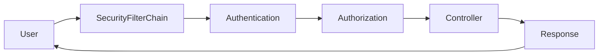
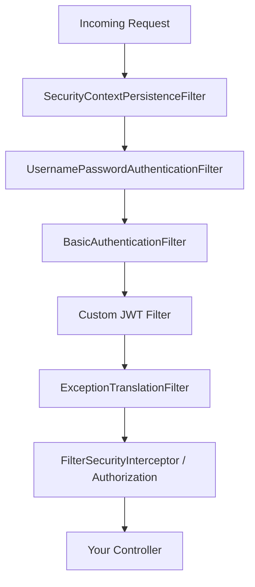
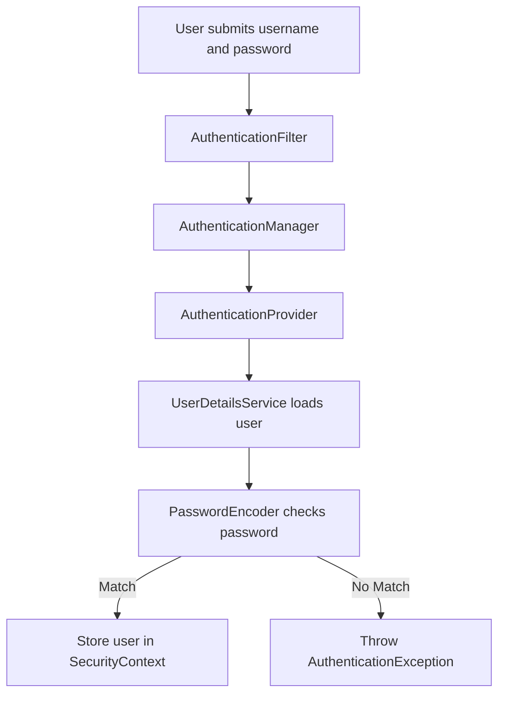
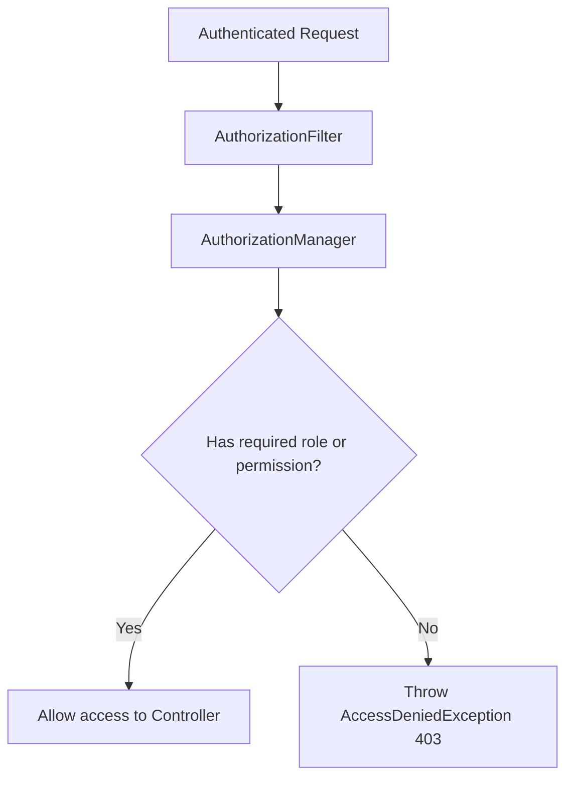

# Spring Security Complete Guide for Beginners

> A complete, beginner-friendly guide to Spring Security 6 (Spring Boot 3.x).
> Written in simple English. Every concept is explained as if you are learning it for the first time.

---

## Table of Contents

1. [Introduction](#1-introduction)
2. [Why Use Spring Security?](#2-why-use-spring-security)
3. [Core Concepts](#3-core-concepts)
4. [Spring Security Architecture](#4-spring-security-architecture)
5. [Ways to Implement Spring Security](#5-ways-to-implement-spring-security)
6. [Spring Security Setup](#6-spring-security-setup)
7. [Basic Security Implementation](#7-basic-security-implementation)
8. [Lambda Style Configuration](#8-lambda-style-configuration)
9. [Role Based Security](#9-role-based-security)
10. [Password Encoding](#10-password-encoding)
11. [JWT Security](#11-jwt-security)
12. [OAuth2 Login](#12-oauth2-login)
13. [Secure REST APIs](#13-secure-rest-apis)
14. [Exception Handling](#14-exception-handling)
15. [Spring Security in AWS EC2 Applications](#15-spring-security-in-aws-ec2-applications)
16. [Spring Security in AWS Lambda Applications](#16-spring-security-in-aws-lambda-applications)
17. [Production Best Practices](#17-production-best-practices)
18. [Common Mistakes](#18-common-mistakes)
19. [Interview Questions](#19-interview-questions)
20. [Real-World Enterprise Example](#20-real-world-enterprise-example)
21. [Spring Security 6 Features](#21-spring-security-6-features)
22. [Complete Cheat Sheet](#22-complete-cheat-sheet)

---

## 1. Introduction

### What is Spring Security?

Spring Security is a **framework** that adds **security** to your Spring applications.

Think of it as a **security guard** for your application. Before anyone can enter a room (a web page or an API), the guard checks:

- **Who are you?** (Authentication)
- **Are you allowed here?** (Authorization)

Spring Security handles both of these jobs for you, so you don't have to write all the security code yourself.

### Why is Spring Security Needed?

Without security, **anyone** can access your application. That means:

- Anyone can see private user data.
- Anyone can delete records.
- Anyone can make payments.
- Anyone can act like an admin.

That is dangerous. Spring Security stops this.

### What Problems Does It Solve?

Spring Security solves these common problems:

| Problem | What Spring Security Does |
|---------|---------------------------|
| Unknown users accessing data | Forces users to log in |
| Wrong user accessing admin pages | Checks user roles |
| Passwords stored as plain text | Encrypts passwords |
| Hackers stealing sessions | Manages sessions safely |
| Fake form submissions | Adds CSRF protection |
| Insecure APIs | Secures REST endpoints |

### Real-World Examples of Security Issues

**Example 1: No login check**
A banking app forgets to check who is logged in. A user changes the URL from `/account/123` to `/account/124` and sees **someone else's** bank account.

**Example 2: Plain text passwords**
A website stores passwords like `password123` directly in the database. A hacker steals the database and now has **everyone's** passwords.

**Example 3: Everyone is an admin**
A shopping site has an `/admin/delete-product` page but never checks roles. A normal customer finds the URL and deletes all products.

Spring Security prevents **all three** of these problems.

### How Spring Security Protects Applications

Spring Security sits **between the user and your code**. Every request goes through it first.

```
User Request  --->  [ Spring Security Checks ]  --->  Your Controller
```

If the checks pass, the request reaches your code. If they fail, the user gets a **401 (not logged in)** or **403 (not allowed)** error.

**Simple Example:**

When you add Spring Security to a Spring Boot project, **every** page is instantly protected. Spring even creates a default login page and a default user for you. You did not write any security code, but your app is already protected.

---

## 2. Why Use Spring Security?

Here are the main benefits, each with a small real-world example.

### 1. Authentication (Who are you?)

Authentication checks the identity of the user, usually with a username and password.

**Real-world example:** When you log in to Gmail with your email and password, Gmail is *authenticating* you.

### 2. Authorization (What can you do?)

Authorization checks what an authenticated user is allowed to do.

**Real-world example:** On YouTube, a normal user can watch videos, but only a channel owner can delete their videos. Same login system, different permissions.

### 3. Password Protection

Spring Security encrypts passwords so they are never stored as plain text.

**Real-world example:** When you sign up on a website, your password `mypass123` is stored as something like `$2a$10$Xy9...`. Even the developers cannot read your real password.

### 4. Session Management

Spring Security tracks logged-in users and can stop attacks like session hijacking.

**Real-world example:** A bank logs you out automatically after 5 minutes of no activity, so no one can use your session if you walk away.

### 5. CSRF Protection

CSRF (Cross-Site Request Forgery) stops attackers from tricking your browser into doing actions you did not mean to do.

**Real-world example:** You are logged into your bank. You click a bad link in an email that secretly tries to transfer money. CSRF protection blocks this fake request.

### 6. Secure APIs

Spring Security protects REST APIs, not just web pages.

**Real-world example:** A mobile app calls `GET /api/orders`. Spring Security checks the token in the request before returning any order data.

### 7. Integration with OAuth2 and JWT

Spring Security supports modern login methods.

**Real-world example:** "Login with Google" (OAuth2) or a token-based login for mobile apps (JWT). Spring Security supports both out of the box.

---

## 3. Core Concepts

This section explains the most important words in Spring Security. Learn these and everything else becomes easy.

### Authentication

- **Definition:** Proving who you are.
- **Why needed:** To make sure the user is real and not a stranger.
- **Example:** Entering username `john` and password `1234` to log in.

### Authorization

- **Definition:** Deciding what an authenticated user can access.
- **Why needed:** Different users need different access. Admins can do more than normal users.
- **Example:** Only users with `ROLE_ADMIN` can open `/admin`.

### Principal

- **Definition:** The currently logged-in user.
- **Why needed:** Your code often needs to know "who is using the app right now?"
- **Example:**

```java
@GetMapping("/me")
public String currentUser(Principal principal) {
    return "Hello " + principal.getName(); // returns the logged-in username
}
```

### UserDetails

- **Definition:** An interface that holds user information (username, password, roles).
- **Why needed:** Spring Security needs a standard way to read user data.
- **Example:**

```java
UserDetails user = User.withUsername("john")
        .password("{noop}1234")
        .roles("USER")
        .build();
```

### UserDetailsService

- **Definition:** An interface with one method that loads a user by username.
- **Why needed:** Spring Security calls this to find the user during login (for example, from a database).
- **Example:**

```java
@Service
public class MyUserDetailsService implements UserDetailsService {
    @Override
    public UserDetails loadUserByUsername(String username) {
        // Normally you fetch this from the database
        return User.withUsername(username)
                   .password("{noop}1234")
                   .roles("USER")
                   .build();
    }
}
```

### SecurityContext

- **Definition:** A place where Spring Security stores details of the current user.
- **Why needed:** So any part of your app can find out who is logged in.
- **Example:**

```java
Authentication auth = SecurityContextHolder.getContext().getAuthentication();
String username = auth.getName();
```

### SecurityFilterChain

- **Definition:** A list of filters that every request passes through.
- **Why needed:** This is where you define your security rules (which URLs are public, which need login, etc.).
- **Example:** (Explained in detail in Section 8.)

### PasswordEncoder

- **Definition:** A tool that encrypts (hashes) passwords.
- **Why needed:** So passwords are never stored as plain text.
- **Example:**

```java
@Bean
public PasswordEncoder passwordEncoder() {
    return new BCryptPasswordEncoder();
}
```

### Roles

- **Definition:** A group name that describes a user type, like `ADMIN` or `USER`.
- **Why needed:** To give access based on the type of user.
- **Example:** `ROLE_ADMIN`, `ROLE_USER`.

### Permissions (Authorities)

- **Definition:** Fine-grained actions a user can do, like `READ` or `WRITE`.
- **Why needed:** Sometimes roles are too broad and you need specific actions.
- **Example:** `product:read`, `product:delete`.

### Sessions

- **Definition:** A way to remember a logged-in user across many requests.
- **Why needed:** So users do not need to log in on every single request (in traditional web apps).
- **Example:** After login, a cookie called `JSESSIONID` keeps you logged in.

### JWT (JSON Web Token)

- **Definition:** A signed token that carries user information.
- **Why needed:** For stateless login, especially in REST APIs and mobile apps (no server session needed).
- **Example:** `eyJhbGciOiJIUzI1NiJ9.eyJzdWIiOiJqb2huIn0.abc123`

### OAuth2

- **Definition:** A standard for logging in using another provider (Google, GitHub, etc.).
- **Why needed:** So users can log in without creating a new password on your site.
- **Example:** "Login with Google" button.

---

## 4. Spring Security Architecture

Let's understand how a request flows through Spring Security.

### Request Flow (High Level)



**Step-by-step:**

1. **User** sends a request (for example, `GET /orders`).
2. The request enters the **SecurityFilterChain** (a series of security filters).
3. **Authentication** checks: "Who is this user?"
4. **Authorization** checks: "Is this user allowed to access `/orders`?"
5. If allowed, the request reaches your **Controller**.
6. The controller creates a **Response** and sends it back to the user.

### Filter Chain

Spring Security is built on **filters**. A filter is code that runs before your controller. Requests pass through many filters, one after another.



Each filter has one job:

- One reads existing login info.
- One handles form login.
- One handles basic auth.
- A custom one may handle JWT.
- One handles authorization rules.

### Authentication Process



**Explanation of each step:**

1. The user submits a username and password.
2. The **AuthenticationFilter** catches this.
3. It passes the details to the **AuthenticationManager**.
4. The manager asks an **AuthenticationProvider** to verify.
5. The provider uses **UserDetailsService** to load the user.
6. The **PasswordEncoder** checks if the password matches.
7. If correct, the user is stored in the **SecurityContext** (now logged in).
8. If wrong, an error is thrown.

### Authorization Process



**Explanation:**

1. The user is already logged in.
2. The **AuthorizationFilter** checks the request.
3. The **AuthorizationManager** decides if the user has the right role or permission.
4. If **yes**, access is allowed.
5. If **no**, a **403 Forbidden** error is returned.

---

## 5. Ways to Implement Spring Security

There are several ways to secure an application. Let's look at five common methods.

### Method 1: Basic Authentication

**What it is:**
The username and password are sent with **every** request in the HTTP header (Base64 encoded).

**Advantages:**
- Very simple to set up.
- Good for testing and internal tools.

**Disadvantages:**
- Password is sent on every request.
- Not safe without HTTPS.
- No logout concept.

**Implementation example:**

```java
@Bean
public SecurityFilterChain filterChain(HttpSecurity http) throws Exception {
    return http
        .authorizeHttpRequests(auth -> auth.anyRequest().authenticated())
        .httpBasic(Customizer.withDefaults()) // enables basic auth
        .build();
}
```

**When to use:**
Internal tools, quick tests, or machine-to-machine calls over HTTPS.

---

### Method 2: Form Login Authentication

**What it is:**
Spring Security shows an HTML **login form**. The user logs in once and stays logged in via a session.

**Advantages:**
- User-friendly for websites.
- Supports logout.
- Uses sessions.

**Disadvantages:**
- Uses server sessions (harder to scale).
- Not ideal for REST APIs or mobile apps.

**Implementation example:**

```java
@Bean
public SecurityFilterChain filterChain(HttpSecurity http) throws Exception {
    return http
        .authorizeHttpRequests(auth -> auth.anyRequest().authenticated())
        .formLogin(Customizer.withDefaults()) // enables form login
        .logout(Customizer.withDefaults())
        .build();
}
```

**When to use:**
Traditional web applications with server-rendered HTML pages.

---

### Method 3: JWT Authentication

**What it is:**
The user logs in once and gets a **token (JWT)**. They send this token with every future request instead of a password.

**Advantages:**
- Stateless (no server session needed).
- Great for REST APIs and mobile apps.
- Easy to scale.

**Disadvantages:**
- More code to write.
- Tokens cannot be easily "cancelled" before they expire.

**Implementation example (concept):**

```java
// After login, generate a token:
String token = jwtService.generateToken(userDetails);

// Client sends it in every request:
// Authorization: Bearer <token>
```

(Full example in Section 11.)

**When to use:**
REST APIs, mobile backends, microservices.

---

### Method 4: OAuth2

**What it is:**
Login using a trusted provider like Google, GitHub, or Microsoft.

**Advantages:**
- No need to store passwords.
- Trusted and secure.
- Users log in fast.

**Disadvantages:**
- Depends on a third party.
- Slightly more setup (client ID, secret).

**Implementation example:**

```java
@Bean
public SecurityFilterChain filterChain(HttpSecurity http) throws Exception {
    return http
        .authorizeHttpRequests(auth -> auth.anyRequest().authenticated())
        .oauth2Login(Customizer.withDefaults()) // enables "Login with Google" etc.
        .build();
}
```

(Full example in Section 12.)

**When to use:**
Public apps where users prefer social login.

---

### Method 5: LDAP Authentication

**What it is:**
Login using a company's central directory (LDAP / Active Directory).

**Advantages:**
- Central user management for companies.
- One password for many systems.

**Disadvantages:**
- Needs an LDAP server.
- More complex setup.

**Implementation example (concept):**

```java
@Bean
public SecurityFilterChain filterChain(HttpSecurity http) throws Exception {
    return http
        .authorizeHttpRequests(auth -> auth.anyRequest().authenticated())
        .httpBasic(Customizer.withDefaults())
        .build();
}

// LDAP is configured via an AuthenticationManager pointing to the LDAP server.
```

**When to use:**
Large companies with existing Active Directory or LDAP.

---

### Comparison Table

| Method | Stateful/Stateless | Best For | Difficulty | Needs HTTPS |
|--------|-------------------|----------|-----------|-------------|
| Basic Auth | Stateless | Testing, internal tools | Easy | Yes |
| Form Login | Stateful (session) | Web apps with HTML | Easy | Yes |
| JWT | Stateless | REST APIs, mobile | Medium | Yes |
| OAuth2 | Depends | Social login | Medium | Yes |
| LDAP | Stateful | Company directories | Hard | Yes |

---

## 6. Spring Security Setup

Let's set up a Spring Boot 3.x project with Spring Security.

### Step 1: Add the Dependency

Adding just **one** starter dependency enables Spring Security automatically.

### Maven Dependencies

Add this to your `pom.xml`:

```xml
<dependency>
    <groupId>org.springframework.boot</groupId>
    <artifactId>spring-boot-starter-security</artifactId>
</dependency>
```

### Gradle Dependencies

Add this to your `build.gradle`:

```gradle
implementation 'org.springframework.boot:spring-boot-starter-security'
```

### Required Starters

For a typical web app you usually need:

- `spring-boot-starter-web` (for web/REST).
- `spring-boot-starter-security` (for security).
- Optional: `spring-boot-starter-oauth2-client` (for OAuth2 login).
- Optional: JWT libraries (for JWT).

### Complete `pom.xml` Snippet (Spring Boot 3.x)

```xml
<?xml version="1.0" encoding="UTF-8"?>
<project xmlns="http://maven.apache.org/POM/4.0.0"
         xmlns:xsi="http://www.w3.org/2001/XMLSchema-instance"
         xsi:schemaLocation="http://maven.apache.org/POM/4.0.0
                             https://maven.apache.org/xsd/maven-4.0.0.xsd">

    <modelVersion>4.0.0</modelVersion>

    <!-- Spring Boot parent: gives you sensible default versions -->
    <parent>
        <groupId>org.springframework.boot</groupId>
        <artifactId>spring-boot-starter-parent</artifactId>
        <version>3.3.0</version>
        <relativePath/> <!-- look up parent from repository -->
    </parent>

    <!-- Your project details -->
    <groupId>com.example</groupId>
    <artifactId>security-demo</artifactId>
    <version>1.0.0</version>
    <name>security-demo</name>
    <description>Spring Security Complete Guide Demo</description>

    <properties>
        <java.version>17</java.version>
        <!-- JWT library version -->
        <jjwt.version>0.12.6</jjwt.version>
    </properties>

    <dependencies>

        <!-- ============================================= -->
        <!-- CORE: Web + Security (required)               -->
        <!-- ============================================= -->

        <!-- REST APIs and web controllers -->
        <dependency>
            <groupId>org.springframework.boot</groupId>
            <artifactId>spring-boot-starter-web</artifactId>
        </dependency>

        <!-- Spring Security (authentication + authorization) -->
        <dependency>
            <groupId>org.springframework.boot</groupId>
            <artifactId>spring-boot-starter-security</artifactId>
        </dependency>

        <!-- ============================================= -->
        <!-- JWT SUPPORT (for token-based auth)            -->
        <!-- ============================================= -->

        <dependency>
            <groupId>io.jsonwebtoken</groupId>
            <artifactId>jjwt-api</artifactId>
            <version>${jjwt.version}</version>
        </dependency>
        <dependency>
            <groupId>io.jsonwebtoken</groupId>
            <artifactId>jjwt-impl</artifactId>
            <version>${jjwt.version}</version>
            <scope>runtime</scope>
```
